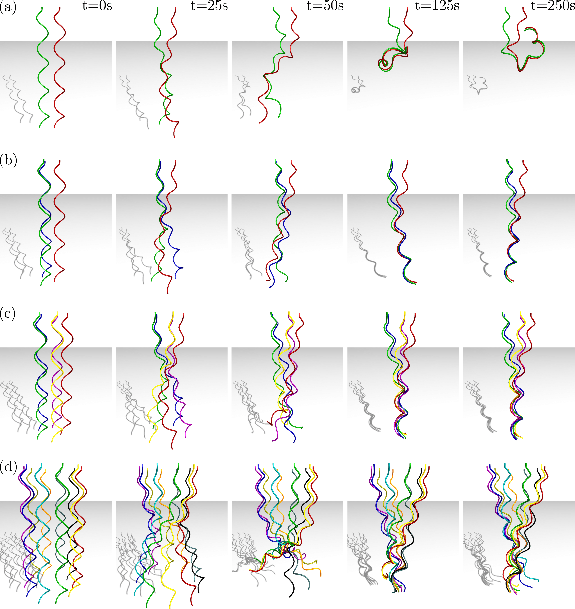

## [A Fully Implicit Method for Robust Frictional Contact Handling](https://www.youtube.com/watch?v=HovfO8OpIZw)

A fully implicit penalty-based contact method, Implicit Contact Model (IMC), for 3D elastic rod simulations. Uses [Discrete Elastic Rod (DER)](http://www.cs.columbia.edu/cg/pdfs/143-rods.pdf) framework to simulate the physics of elastic rods and incorporates IMC to simulate both contact and friction. The following code is an end-to-end framework for simulating rotating multiple flagella in a viscous fluid. Accurate contact handling and solid-fluid interaction produce the physical phenomenon known as "flagella bundling" as shown below in Figure 1.


<p align="center">

<br>
<em> Figure 1. Simulation examples for flagella bundling with varying number of flagella. </em>
</p>

***

## How to Use

### Dependencies
Install the following C++ dependencies:
- [Eigen](http://eigen.tuxfamily.org/index.php?title=Main_Page)
    - Eigen is used for various linear algebra operations.
    - IMC is built with Eigen version 3.4.0 which can be downloaded [here](https://gitlab.com/libeigen/eigen/-/releases/3.4.0). After downloading the source code, install through cmake as follows.
      ```bash
      cd eigen-3.4.0 && mkdir build && cd build
      cmake ..
      sudo make install
      ```
- [SymEngine](https://github.com/symengine/symengine)
    - SymEngine is used for symbolic differentiation and function generation.
    - Before installing SymEngine, LLVM is required which can be installed through apt.
      ```bash
      sudo apt-get install llvm
      ```
    - Afterwards, install SymEngine from source using the following commands.
      ```bash
      git clone https://github.com/symengine/symengine    
      cd symengine && mkdir build && cd build
      cmake -DWITH_LLVM=on ..
      make -j4
      sudo make install
      ```
- [Intel oneAPI Math Kernel Library (oneMKL)](https://www.intel.com/content/www/us/en/developer/tools/oneapi/onemkl-download.html?operatingsystem=linux&distributions=webdownload&options=online)
    - Necessary for access to Pardiso, which is used as a sparse matrix solver.
    - Intel MKL is also used as the BLAS / LAPACK backend for Eigen.
    - If you are using Linux, follow the below steps. Otherwise, click the link above for your OS.
      ```bash
      cd /tmp
      wget https://registrationcenter-download.intel.com/akdlm/irc_nas/18483/l_onemkl_p_2022.0.2.136.sh
      
      # This runs an installer, simply follow the instructions.
      sudo sh ./l_onemkl_p_2022.0.2.136.sh
      ```
    - Add the following to your .bashrc. Change the directory accordingly if your MKL version is different.
      ```bash
      export MKLROOT=/opt/intel/oneapi/mkl/2022.0.2
      ```

- [OpenGL / GLUT](https://www.opengl.org/)
    - OpenGL / GLUT is used for rendering the knot through a simple graphic.
    - Simply install through apt package manager:
        ```bash
      sudo apt-get install libglu1-mesa-dev freeglut3-dev mesa-common-dev
      ```
- Lapack (*usually preinstalled on your computer*)

***
### Compiling
After completing all the necessary above steps, clone the source repository of IMC and then build the project through cmake.
```bash
mkdir build && cd build
cmake ..
make -j4
```

***

### Setting Parameters

All simulation parameters are set through a parameter file ```option.txt```. A template file ```template_option.txt``` is provided that can be used to construct ```option.txt```.

```bash
cp template_option.txt option.txt   # create option.txt
```
Specifiable parameters are as follows (we use SI units):
- ```helixRadius``` - Radius of the helix.
- ```helixPitch``` - Pitch of the helix.
- ```numFlagella``` - Number of flagella to simulate.
- ```rodRadius``` - Cross-sectional radius of the flagella.
- ```youngM``` - Young's modulus.
- ```Poisson``` - Poisson ratio.
- ```deltaTime``` - Time step size.
- ```totalTime``` - The total time for the simulation to run.
- ```tol``` and ```stol``` - Small numbers used in solving the linear system. Fraction of a percent, e.g. 1.0e-3, is often a good choice.
- ```maxIter``` - Maximum number of iterations allowed before the solver quits.
- ```density``` - Mass per unit volume.
- ```gVector``` - 3x1 vector specifying acceleration due to gravity.
- ```viscosity``` - Viscosity of the fluid medium.
- ```epsilon``` - Regularization coefficient for RSS.
- ```axisLengthInput``` - Axis length of flagella.
- ```deltaLengthInput``` - Length of each edge.
- ```distance``` - Distance between the flagella.
- ```render (0 or 1) ```- Flag indicating whether OpenGL visualization should be rendered.
- ```saveData (0 or 1)``` - Flag indicating whether sim data and config data should be recorded.
- ```omega``` - Angular velocity of clamped flagella ends.
- ```mu``` - Friction coefficient. A value of zero turns friction off (*ignored if ipc option is on*).
- ```nu``` - Slipping tolerance for friction.
- ```delta``` - Distance tolerance for contact.
- ```colLimit``` - Distance limit for inclusion in contact candidate set (*colLimit must be > delta*).
- ```lineSearch (0 or 1)``` - Flag indicating whether line search will be used.
- ```ipc (0 or 1)``` - Flag indicating whether IPC's barrier function and line search should be used.

***
### Running the Simulation
Once parameters are set to your liking, the simulation can be ran from the terminal by running the provided script:
```bash
./run.sh
```
If this doesn't work, execute ```chmod +x run.sh``` prior to running.

***

### Citation
If our work has helped your research, please cite the following papers.
```
@article{choi_imc_2021,
    author = {Choi, Andrew and Tong, Dezhong and Jawed, Mohammad K. and Joo, Jungseock},
    title = "{Implicit Contact Model for Discrete Elastic Rods in Knot Tying}",
    journal = {Journal of Applied Mechanics},
    volume = {88},
    number = {5},
    year = {2021},
    month = {03},
    issn = {0021-8936},
    doi = {10.1115/1.4050238},
    url = {https://doi.org/10.1115/1.4050238},
}

@article{tong_imc_2022,
    author = {Dezhong Tong and Andrew Choi and Jungseock Joo and M. Khalid Jawed},
    title = {A fully implicit method for robust frictional contact handling in elastic rods},
    journal = {Extreme Mechanics Letters},
    volume = {58},
    pages = {101924},
    year = {2023},
    issn = {2352-4316},
    doi = {https://doi.org/10.1016/j.eml.2022.101924},
    url = {https://www.sciencedirect.com/science/article/pii/S2352431622002000},
}
```

